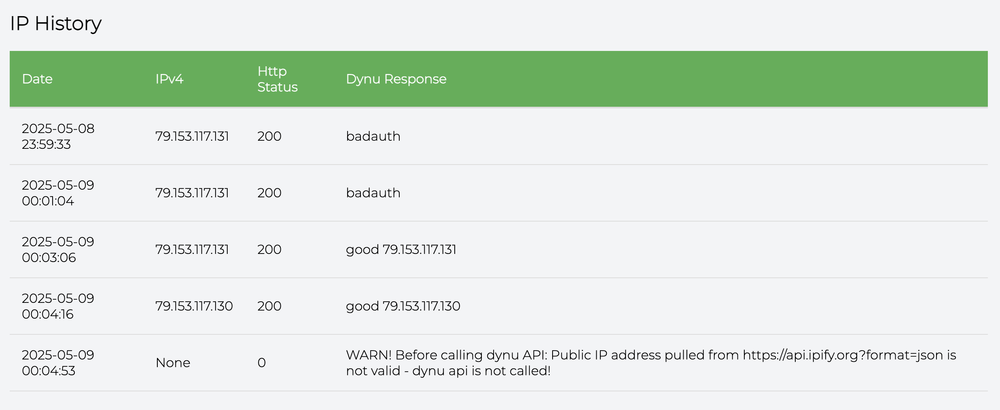

# Dynu DDNS IP Client Updater

## 📘 Introduction

Docker image to update a [Dynu DDNS](https://www.dynu.com) domain with your current IP from your ISP provider.

It also tracks all IP changes an exposes them through a http server on port 1050.

<table>
<tr>
<td valign="top">
<i>IP History Server</i><br>

</td>
</tr>
</table>

## ✅ Project structure

```
project-root/
├── docker-compose.yml
├── README.md
├── ip_history.png
└── dynuiuc/
    ├── .dockerignore
    ├── requirements.txt
    ├── Dockerfile
    ├── db/
    │   └── ip_history.db
    ├── python/
    │   ├── apicalls.py
    │   ├── apiresponse.py
    │   ├── database.py
    │   ├── envvars.py
    │   ├── history_server.py
    │   └── main.py
    └── tempates/
        └── status_template.html

```

## 🔍 Explanation

- ```docker-compose.yml```: docker compose configuration
- ```dynuiuc/Dockerfile```: docker build configuration
- ```dynuiuc/.dockerignore```: docker build configuration support

## 🛠️ Installation

1.  Copy files into your docker installation 
2.  Execute
```
docker compose up --build -d
```

## 🧪 Test Installation

Open your favourite browser to:
1. *IP History*
```
http://<your-ip>:1050/status 
````

## 🛠️ Docker compose environment values

Change values as your needs:
```
version: '3.8'

services:
  dynuiuc:
    build: ./dynuiuc
    container_name: dynuiuc
    restart: unless-stopped
    ports:
      - "1050:1050"
    environment:
      - TZ=Europe/Madrid
      - USERNAME=YOUR_DYNU_USERNAME
      - PASSWORD=YOUR_DYNU_PASS
      - HOSTNAMES=YOUR_DOMAIN
      - DYNU_UPDATE_URL=https://api.dynu.com/nic/update
      - IP_SOURCES=https://api.ipify.org?format=json
      - REFRESH_TIME=300
      - DB_FILE=db/ip_history.db
      - TEMPLATES_DIR=templates

```

## 🏆 Credits

This docker image has been created based on [dokeraj one](https://hub.docker.com/r/dokeraj/dynu-updater)
